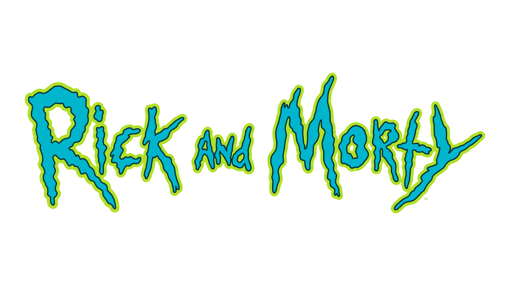

# 🧠 Jogo da Memória — Rick and Morty

Projeto de um jogo da memória inspirado na série **Rick and Morty**, desenvolvido com HTML, CSS e JavaScript.

O objetivo do jogo é encontrar todos os pares de cartas iguais no menor número possível de tentativas.

Este projeto foi desenvolvido como prática de lógica de programação e manipulação do DOM com JavaScript.

---

# 🎮 Demonstração

🔗 Projeto Online

🔗 Repositório

---

# 🕹️ Como jogar

1. Clique em uma carta para revelá-la.
2. Clique em outra carta para tentar encontrar o par correspondente.
3. Se as cartas forem iguais, elas permanecem viradas.
4. Se forem diferentes, elas voltam a ficar escondidas.
5. O objetivo é encontrar todos os pares.

---

# 🛠️ Tecnologias utilizadas

* HTML
* CSS
* JavaScript

---

---

# 🎯 Conceitos praticados

* Manipulação do DOM
* Eventos em JavaScript
* Lógica de jogo
* Estruturação de layout com CSS
* Organização de arquivos em projetos web

---

# 🎓 Contexto do projeto

Projeto desenvolvido como exercício prático para aprimorar conhecimentos em desenvolvimento front-end.

---

# 👨‍💻 Autor

Desenvolvido por **Felipixel-Martins**

Projetos educacionais focados no aprendizado de desenvolvimento web.

