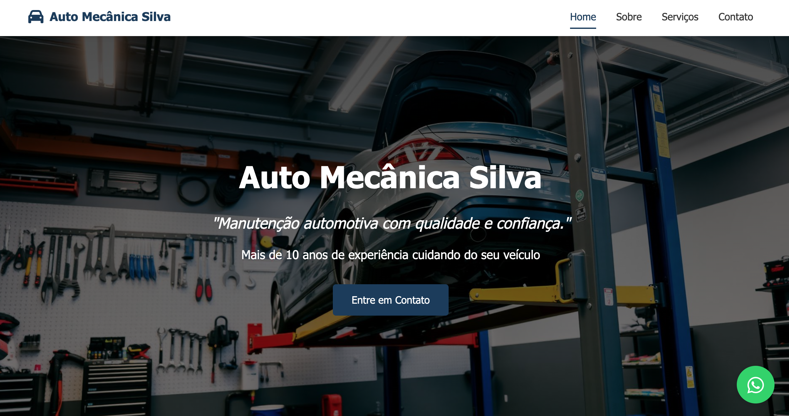

# Bem-vindo ao Projeto



## Informações do Projeto

Link page: https://felipixel-martins.github.io/site-mecanica-silva/

Repositório para exibir o **Projeto do HANDS ON WORK V - UNIVALI ADS - 2026**.

Este projeto consiste em uma **página web simples** desenvolvida como parte das atividades do curso de **Análise e Desenvolvimento de Sistemas da UNIVALI**.

Este repositório contém o **código-fonte da aplicação**.

## Tecnologias utilizadas no projeto

Este projeto foi desenvolvido utilizando as seguintes tecnologias:

- HTML5

- Css

- JavaScript

---

## Como posso editar este código?

Existem várias maneiras de editar a aplicação.

### Usar sua IDE preferida

Se você deseja trabalhar localmente utilizando sua própria IDE (como **VS Code, WebStorm, entre outras**), basta clonar este repositório e fazer as alterações necessárias.

---

## Passo a passo para executar o projeto

```sh
# Passo 1: Clone o repositório utilizando a URL do projeto
git clone <URL_DO_SEU_REPOSITORIO>

# Passo 2: Acesse a pasta do projeto
cd <NOME_DO_PROJETO>

Após iniciar o servidor, o projeto será executado em ambiente de desenvolvimento com atualização automática ao modificar os arquivos.
